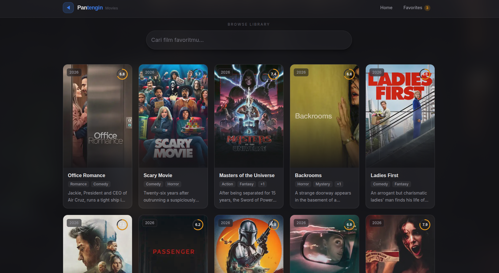
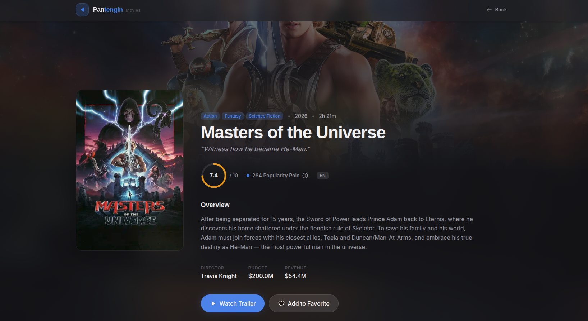
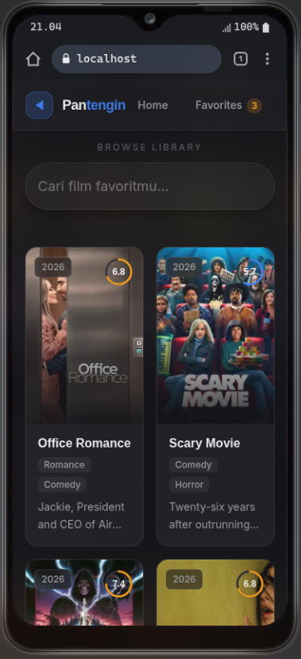
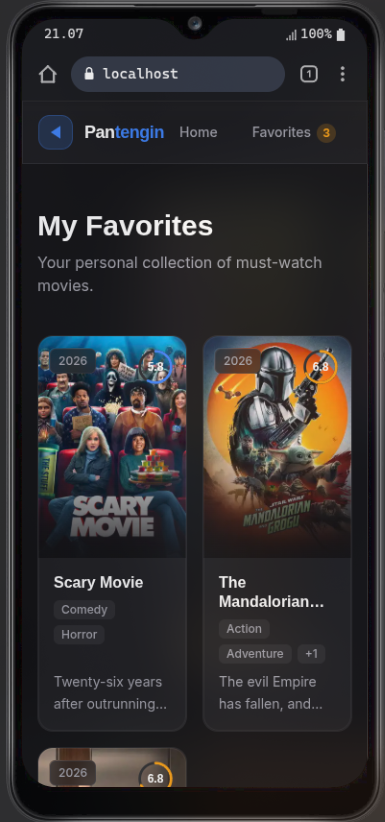

# Pantengin - Movie Search App

<p align="center">
    
</p>

<h1 align="center">Pantengin - Movie Search App</h1>

<p align="center">
    <strong>Aplikasi web pencarian film responsif, modern, dan efisien dengan integrasi TMDB API</strong>
</p>

<p align="center">
    
    
    
    
    
</p>

---
Sebuah aplikasi web pencarian film yang dibangun untuk memberikan pengalaman pengguna yang responsif, modern, dan efisien. Aplikasi ini memanfaatkan API dari TMDB untuk menampilkan daftar film populer, detail film, serta fitur pencarian yang dinamis.


##  Screenshots

### Desktop 
<table width="100%">
  <tr>
    <td width="50%" align="center" valign="top">
      <small>Homepage / Search</small><br/><br/>
      
    </td>
    <td width="50%" align="center" valign="top">
      <small>Movie Detail & Trailer</small><br/><br/>
      
    </td>
  </tr>
</table>

###  Mobile 
<table width="">
  <tr>
    <td width="50%" align="center" valign="top">
      <small>Responsive Homepage</small><br/><br/>
      
    </td>
    <td width="50%" align="center" valign="top">
      <small>My Favorites List</small><br/><br/>
      
    </td>
  </tr>
</table>


## Fitur Utama (Berdasarkan Persyaratan)
1. **Search with Debouncing:** Fitur pencarian film yang dioptimasi menggunakan custom hook debounce (500ms) untuk mencegah pemanggilan API berlebihan saat user sedang mengetik.
2. **Infinite Scroll:** Fitur navigasi data mulus tanpa tombol pagination, dibangun secara manual menggunakan `IntersectionObserver` API bawaan browser.
3. **Detail Movie Page:** Halaman khusus yang menampilkan informasi lengkap film (Sinopsis, Pemeran/Cast, Rating, Genre, dan Trailer Youtube).
4. **My Favorites (Persistence):** Fitur untuk menambah dan menghapus film ke daftar favorit yang state-nya tersimpan secara otomatis di `LocalStorage` (tidak hilang meski browser di-refresh).
5. **Empty & Error States:** Tampilan khusus (beserta *Skeleton Loading* dan Error Boundary halaman 404) yang dirancang elegan jika film tidak ditemukan atau terjadi masalah koneksi ke server.

## Cara Menjalankan Project (How to Run)

Pastikan Node.js sudah terinstal di sistem Anda (direkomendasikan menggunakan versi Node terbaru atau melalui `nvm`).

1. **Clone repository dan masuk ke folder project:**
   ```bash
   git clone <repo-url>
   cd test-movie
   ```

2. **Install dependensi:**
   ```bash
   pnpm install
   ```

3. **Setup Environment Variables:**
   Buat file `.env.local` di *root directory* dan masukkan konfigurasi API TMDB Anda:
   ```env
   NEXT_PUBLIC_TMDB_API_KEY=api_key_anda_disini
   NEXT_PUBLIC_TMDB_BASE_URL=https://api.themoviedb.org/3
   ```

4. **Jalankan local development server:**
   ```bash
   pnpm run dev
   ```

5. **Buka aplikasi:** Akses [http://localhost:3000](http://localhost:3000) di browser Anda.

## Tech Stack

- **Framework:** Next.js 16 (App Router)
- **State Management (Server/Data):** TanStack Query (React Query)
- **State Management (Client/Global):** Zustand (dengan middleware Persist)
- **Styling:** Tailwind CSS
- **Animasi:** Framer Motion
- **Data Source:** TMDB API

## Keputusan Arsitektur (Architectural Decisions)

1. **Next.js App Router:** Saya memilih Next.js agar halaman detail film bisa diproses langsung dari server (Server-Side Rendering). Ini membuat halaman lebih cepat dimuat saat pertama kali dibuka dan sangat bagus agar aplikasi mudah dikenali oleh mesin pencari (SEO).
2. **React Query (TanStack Query):** Saya menggunakan React Query di halaman utama untuk menangani pengambilan data dari API. Library ini sangat membantu untuk membuat fitur *Infinite Scroll* dan menyimpan sementara hasil pencarian (cache) agar aplikasi tidak berulang kali memanggil API yang sama, sehingga performa terasa jauh lebih cepat dan hemat kuota.
3. **Zustand:** Untuk menyimpan data seperti daftar film favorit, saya memilih Zustand karena pengaturannya yang sederhana dan ringkas. Dengan tambahan fitur `persist` bawaan Zustand, daftar favorit pengguna otomatis tersimpan dengan aman di `LocalStorage` tanpa perlu menulis logika penyimpanan manual.
4. **Halaman Detail Terpisah (Bukan Popup/Modal):** , saya memutuskan untuk membuat halaman detail terpisah (contoh: `/movie/[id]`) alih-alih menggunakan *popup*. Alasannya adalah **SEO & Shareability**; setiap film memiliki URL unik yang bisa diindeks oleh mesin pencari dan mudah dibagikan (di-copy) ke orang lain. Selain itu, ini mencegah halaman utama menjadi terlalu berat karena menumpuk banyak elemen *popup* di memori.
5. **Infinite Scroll (Tanpa Tombol Pagination):** Untuk navigasi data yang banyak, saya memilih *Infinite Scroll* karena memberikan pengalaman pengguna (UX) yang jauh lebih mulus dan modern. Pengguna tidak perlu repot menekan tombol "Next Page" berulang kali. Khusus untuk konten visual seperti poster film, cara ini terbukti lebih efektif untuk membuat pengguna nyaman.
6. **Struktur Kode yang Rapi (Separation of Concerns):** Saya memisahkan secara tegas antara kode untuk tampilan/visual (komponen UI) dan kode logika (seperti cara mengambil data API, pencarian, dll) ke dalam folder yang berbeda. Tujuannya agar struktur project menjadi sangat rapi, mudah dibaca, dan mudah dikembangkan lebih lanjut.

## Bonus & Kemungkinan Pengembangan (Improvements)

Jika terdapat waktu alokasi pengembangan lebih, berikut fitur yang ingin saya tambahkan di masa depan:
- **Filterisasi Lanjutan (Advanced Filtering):** Menambahkan sistem filter agar pengguna tidak hanya bisa mencari berdasarkan kata kunci judul, tetapi juga dapat menyaring film secara spesifik berdasarkan Genre, Tahun Rilis, atau kategori lainnya.
- **Pengurutan Data (Sorting):** Menyediakan fitur untuk mengurutkan hasil pencarian atau daftar film (misalnya: dari rating yang paling tinggi, atau dari film yang paling baru dirilis).
- **Automated Testing:** Menambahkan pengujian kode otomatis (Unit Testing / E2E Testing) untuk memastikan fitur-fitur krusial seperti pencarian dan daftar favorit selalu berjalan normal tanpa error saat ada penambahan fitur baru.
